# BusRide en funcionamiento — guía visual y videos demo

**Fecha:** 2026-07-02 · **Cómo se produjo:** cada video es un script de Playwright que ejecuta el
flujo REAL contra el stack completo (SQL Server + backend + frontend), con narración por voz
sintética dominicana y un screenshot automático por paso — nada es mockup: los QR, tickets y
liquidaciones que se ven salieron del backend de verdad. Motor y guiones en [`demos/`](demos/);
proceso documentado en [`COMO_CREAMOS_VIDEOS_DEMO.md`](COMO_CREAMOS_VIDEOS_DEMO.md).

| # | Video | Duración | Qué demuestra |
|---|---|---|---|
| 1 | [`demos/01_registro_login.mp4`](demos/01_registro_login.mp4) | 55 s | Registro de pasajero, login, logout |
| 2 | [`demos/02_panel_admin.mp4`](demos/02_panel_admin.mp4) | 85 s | Panel admin: usuarios, asociaciones, conductores, flota (crea un bus en vivo), rutas |
| 3 | [`demos/03_pasajero.mp4`](demos/03_pasajero.mp4) | 86 s | Pasajero: compra de paquete, búsqueda geoespacial en el mapa, reserva con QR |
| 4 | [`demos/04_conductor.mp4`](demos/04_conductor.mp4) | 100 s | Conductor: iniciar viaje, abordar con token del QR, finalizar y liquidación |

---

## 1. Crear tu cuenta (registro e inicio de sesión)

La pantalla de entrada; los nuevos pasajeros se registran con nombre, correo y contraseña
(mínimo 8 caracteres) y quedan dentro automáticamente:

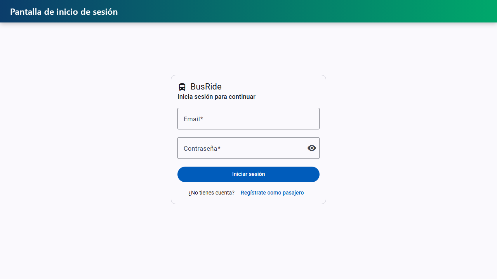

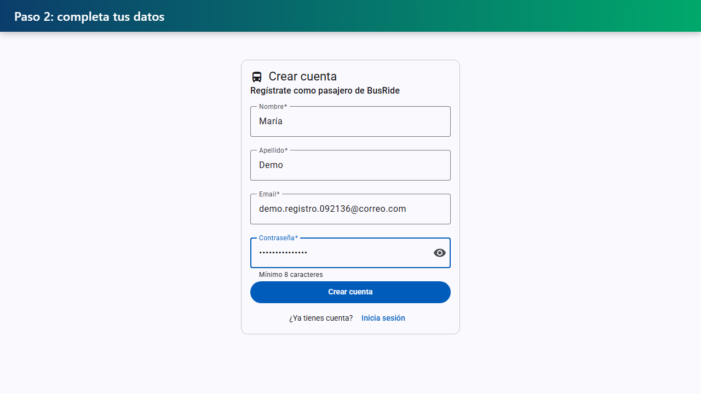

Tras crear la cuenta, el pasajero llega directo a su área con el mapa centrado en su ubicación:

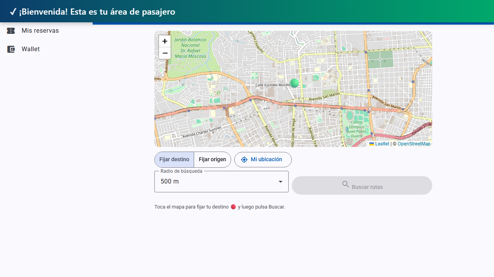

## 2. Panel de administración

El admin gestiona toda la operación: cuentas de usuario, asociaciones de transporte (con RNC y
comisión), conductores con licencia, la flota y las rutas:

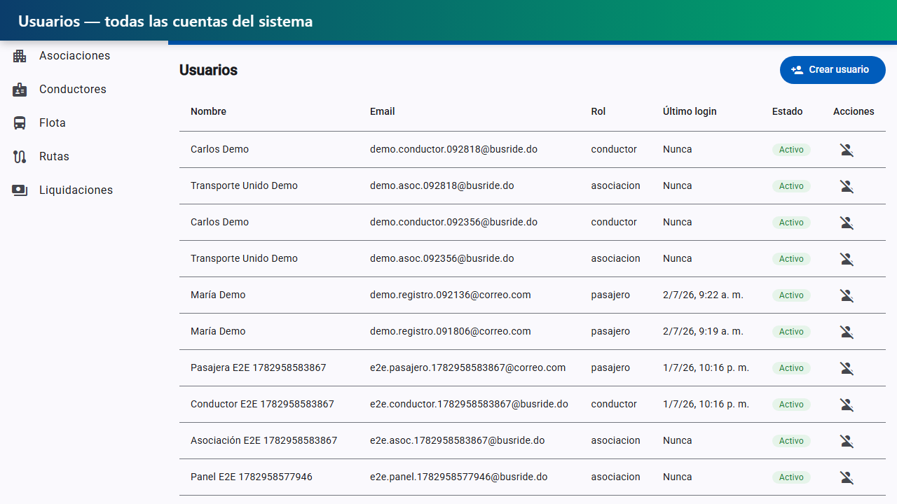

En Flota, con la asociación seleccionada, se registra un bus en vivo desde el diálogo y aparece
de inmediato en el listado:

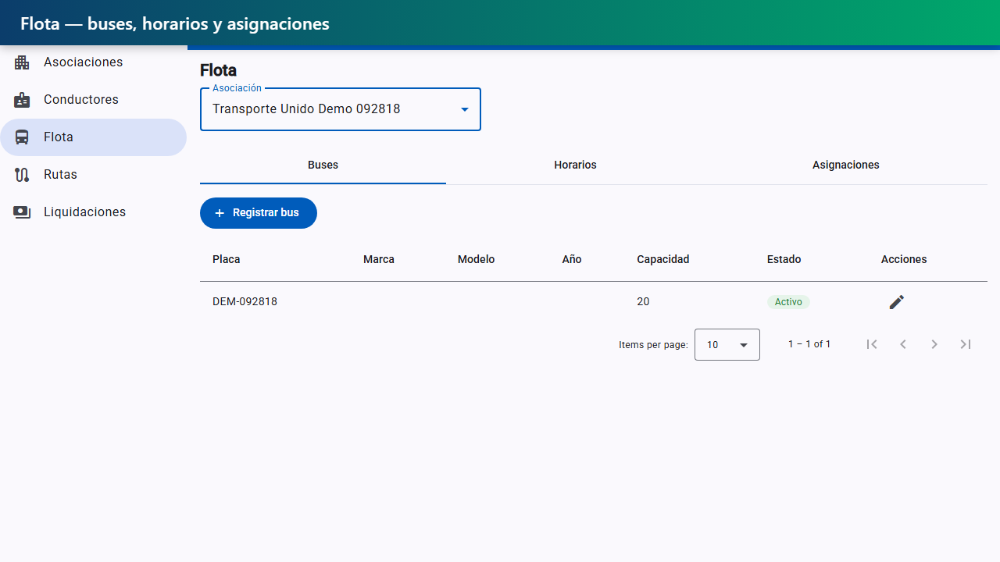

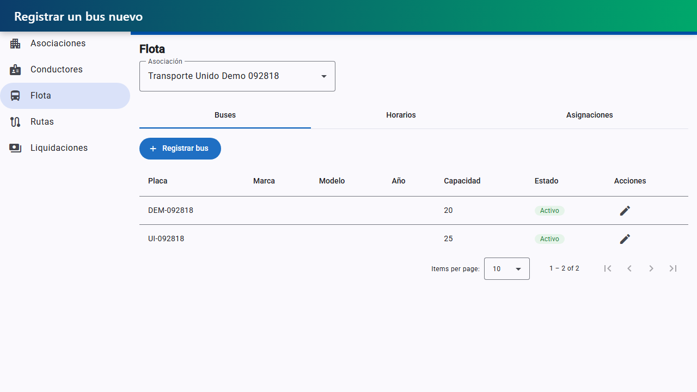

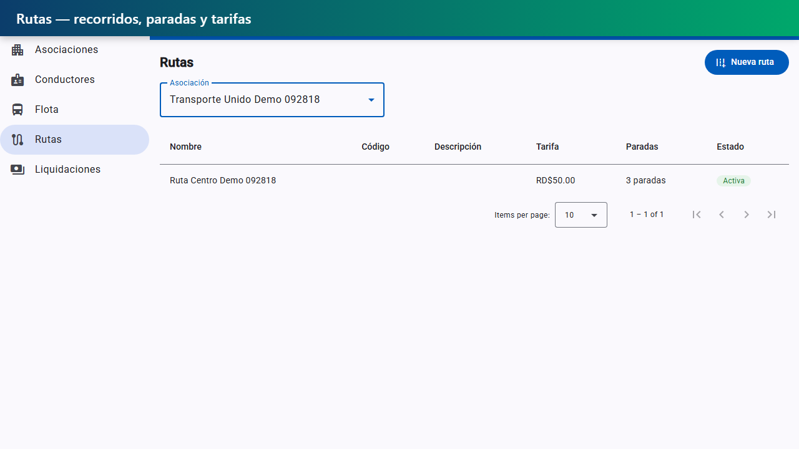

## 3. Viajar como pasajero

El pasajero compra un paquete de viajes en su wallet (el saldo se acredita al instante, con
idempotencia por referencia de pago):

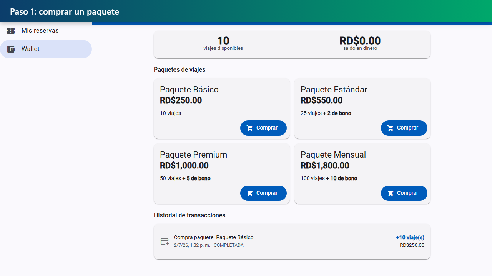

Busca rutas marcando su destino en el mapa (su origen es la geolocalización real): la búsqueda
geoespacial corre en SQL Server (`sp_buscar_rutas_disponibles`) y devuelve las rutas activas con
asientos:

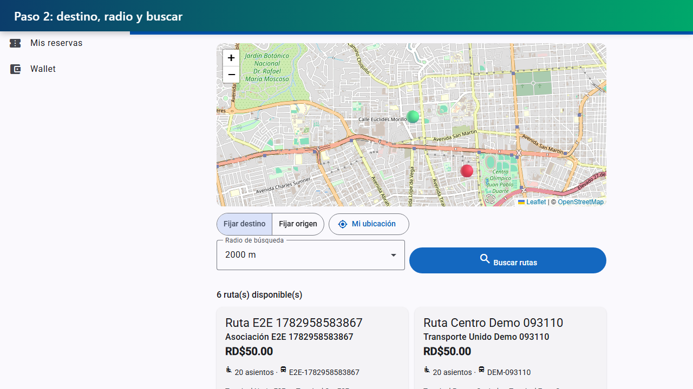

Y reserva: el sistema genera un **QR de abordaje firmado, válido por 5 minutos**, con countdown en
pantalla:

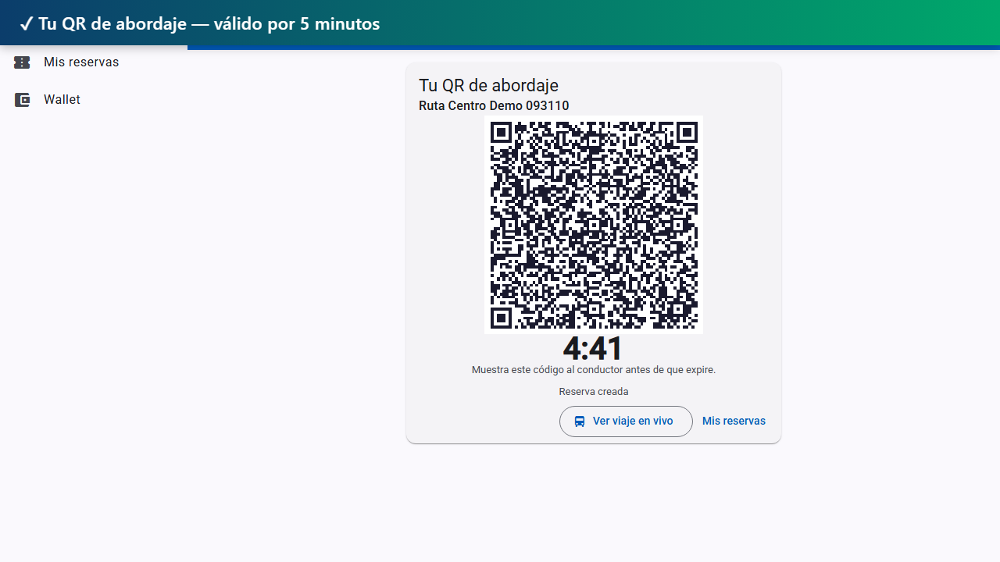

## 4. Operar como conductor

El conductor inicia el viaje desde su asignación; su pantalla muestra el mapa con la ruta, su
posición (transmitida por Socket.IO a los pasajeros) y los asientos libres en vivo:

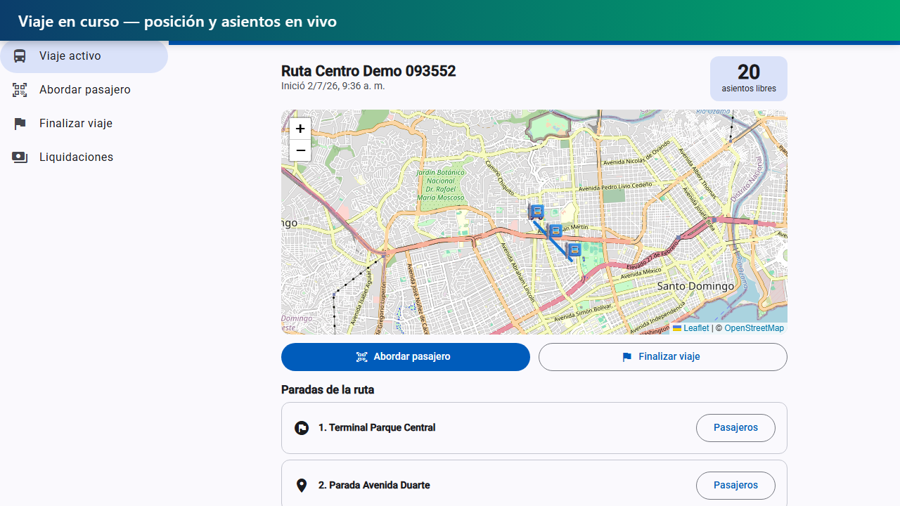

Aborda al pasajero escaneando su QR (o pegando el token, como en el video): el backend valida el
JWT del QR y ejecuta `sp_confirmar_abordaje` — ticket emitido, asiento asignado, viaje descontado
de la wallet:

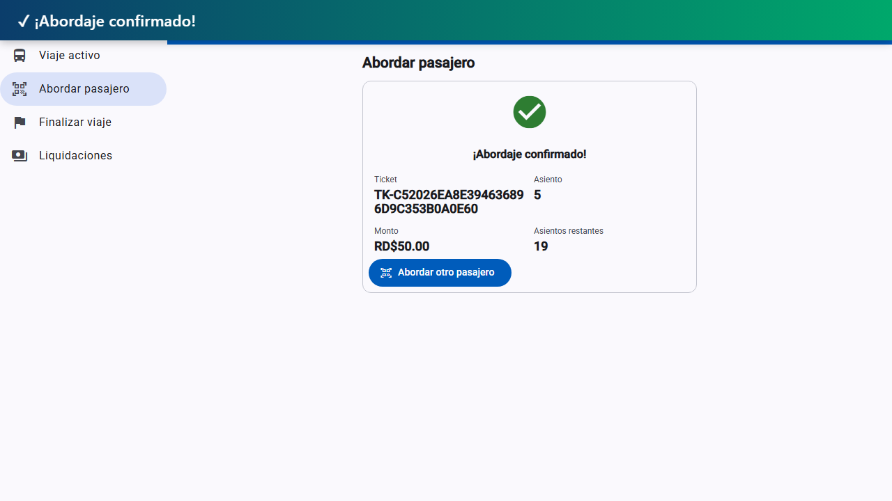

Al finalizar, `sp_liquidar_viaje` genera la liquidación automáticamente — bruto, comisión de la
plataforma, comisión de la asociación y neto del conductor:

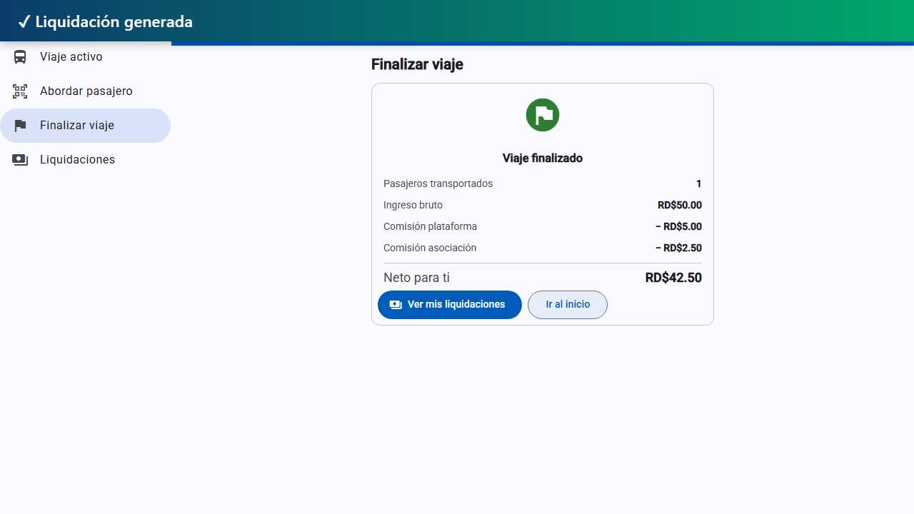

---

## Reproducir estos demos

1. Stack corriendo: SQL Server (`docker compose up -d sqlserver sqlserver-init`), backend en
   :3002 (`node dist/src/main.js` con `PORT=3002`) y frontend `npm start -- --port 4320`.
2. Dependencias una vez: `pip install playwright edge-tts`, `python -m playwright install chromium`,
   ffmpeg en el PATH.
3. `cd docs/demos && python rec_01_registro.py` (ídem 02–04). Cada corrida siembra sus propios
   datos únicos por la API y regenera el `.mp4` y los `.png` de `img/`.
